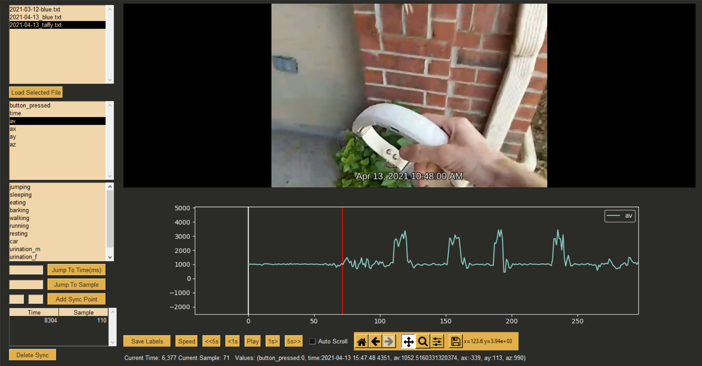

# Python Labeling Tool

##Required Libraries
 - Matplotlib
 - Numpy
 - Pandas
 - PySimpleGUI
 - python-vlc
    - requires vlc to be installed

## hot keys
- space: pause
- 1-9: start/stop labeling with label n
- tab: start/stop labeling with selected label
- Right: forward 5 seconds
- Left: back 5 seconds
- .: forward 1 second
- ,: back 1 second
- middle click on graph: Jump to sample under mouse
- double left click one graph: create label with selected label from current sample to sample under mouse
- double right click: delete label under mouse

## Starting
- Formatted log files go in **data/**
- list of labels go in **labels/labels.txt**
- video files go in **videos/**
    - videos should be named **\<log filename\>-video.mp4** 

## Using

1. File selection
    - The first box on the left contains a list of files in the **data** directory
    - Selecting one of these and clicking **Load Selected File** will load the data from the file and the video that goes with it
    - If there are existing annotations or sync files those will be loaded as well

2. Data Graphing
    - The box below file selection contains a list of data elements found in the current data file
    - Clicking on one of them will plot it on the graph
    - Any amount of elements can be graphed simutaniously

3. Labels
    - The third box contains a list of labels found in **labels/labels.txt**
    - clicking on one of them will choose that label for annotation
    - only one can be selected at a time

4. Jumping
    - The input fields and buttons below the labels are for jumping to a time or sample
    - **Jump To Time** will set the video time to the entered value in milliseconds
    - **Jump to Sample** will move set the current sample to the entered value
    - If there no sync points defined jumping will move each value independently. If there are sync points jumping will move both the current time and sample together

5. Sync
    - The last items in the left column are for synchronizing the data and video
    - Entering a time in the left input field and a sample in the right field will create a sync point with those values after clicking **Add Sync Point**
    - If either field is empty pressing **Add sync Point** will use the current value instead
    - Only one sync point is necessary. Using one sync point will set the sample to the default value of 20 samples/second
    - Using two sync points will cause the sample rate to be dynamically defined
    - To delete a sync point click on it in the table and press **Delete Sync**

6. Video Window
    - The top of the left side of the window contains the video

7. Graph Window
    - Beneath the video is the graph
    -